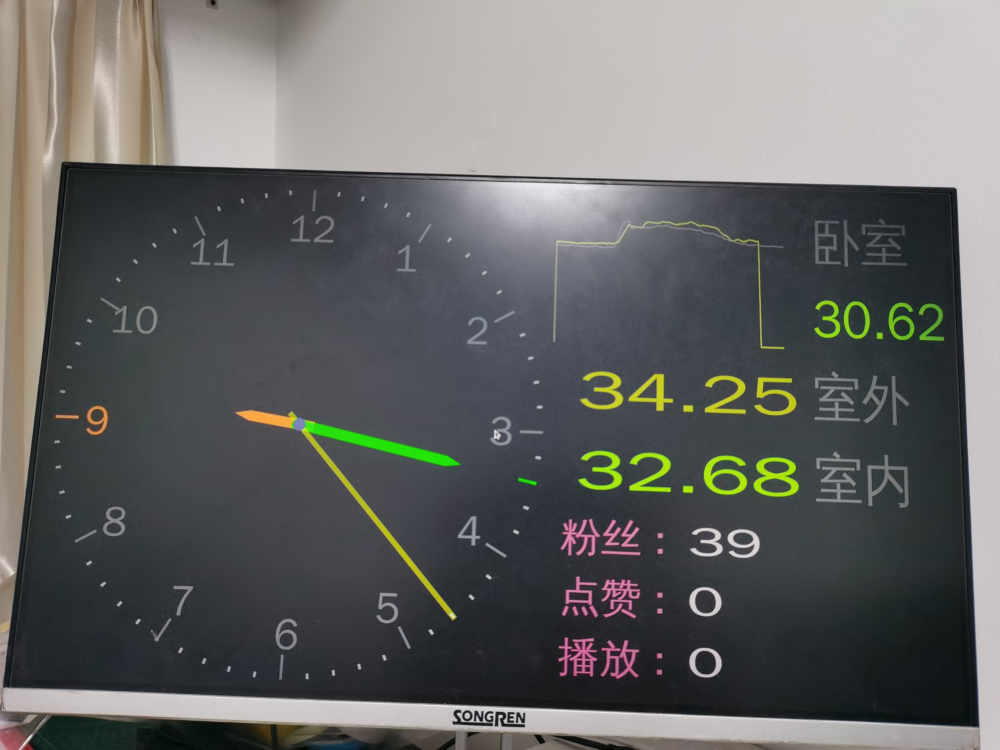

# clock-pyqt
用pyqt编写的一个时钟





#  依赖库
```
pip install PyQt5 paho-mqtt requests
```

# 部署到核桃派box上
使用硬件为walnutpi-box小主机，烧录官方的带桌面且预装了hass的镜像 **2024-7-12_V2.4.0_WalnutPi-1B_6.1.31_Home-Assistant_deaktop**

1. 安装python库
```
sudo pip install requests
```

2. 在hass中安装mqtt集成 https://walnutpi.com/docs/home_assistant/mqtt/add

3. 修改hass的配置文件，让其将所有传感器信息通过mqtt发布出来，往文件中添加如下内容`/usr/share/hassio/homeassistant/configuration.yaml`
```
mqtt_statestream:
  base_topic: homeassistant
  publish_attributes: true
  publish_timestamps: true
```
4. 在hass的界面里点击重启hass本体: `开发者工具->yaml配置->重新启动->重新启动家庭助理`
